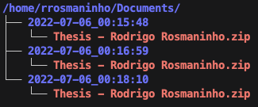

# Automatically backup all your LaTeX projects from your self-hosted Overleaf instance

This tool allows you to periodically download compressed copies of all your Overleaf projects to your local machine.

It consists of a Python script that uses the Selenium library and a headless instance of Google Chrome in order to:
- Browse to your Overleaf instance
- Log in on your behalf
- Click all the download buttons on your project list

To avoid the installation of Selenium and the specific version of the Google Chrome WebDriver, the project runs entirely within a pre-configured Docker container.

This tool only works with self-hosted/on-premises Overleaf, given that overleaf.com employs CAPTCHAs which prevent bots from logging in.

## Usage

### Preparing docker-compose.yml according to your needs

1. Download docker-compose.yml:
```
wget https://raw.githubusercontent.com/RodrigoRosmaninho/selfhosted-overleaf-backup/main/docker-compose.yml
```

2. Select the local directory in which the backups will be saved by editing the first path (before the ":") of the volumes section.


3. Edit the variables in the environment section:

#### OVERLEAF_URL
The URL of your self-hosted/on-premises Overleaf instance. Include "https://" or "http://"

#### OVERLEAF_USERNAME
Your username on your self-hosted/on-premises Overleaf instance.

#### OVERLEAF_PASSWORD
Your password on your self-hosted/on-premises Overleaf instance.

Be mindful of who has access to this file on your local machine.

If your password contains one or more "$" characters, you must escape each one with an additional dollar sign ("$" becomes "$$")

#### BACKUP_FREQUENCY
By default, this tool continuously performs backups once every hour.

This environment variable specifies this frequency in minutes.

You may also set its value to 0, which will result in a single backup, after which the container will terminate.

In that case, you must also remove the "restart: always" line in your docker-compose.yml file.

#### BACKUP_OVERWRITE
When set to "true", the backup tool overwrites previous files on each successful backup.

When set to "false", a subfolder is created for each backup operation, thus safeguarding previous files.



### Running the container

Execute:
```
userid=$(id -u) docker-compose up -d
```